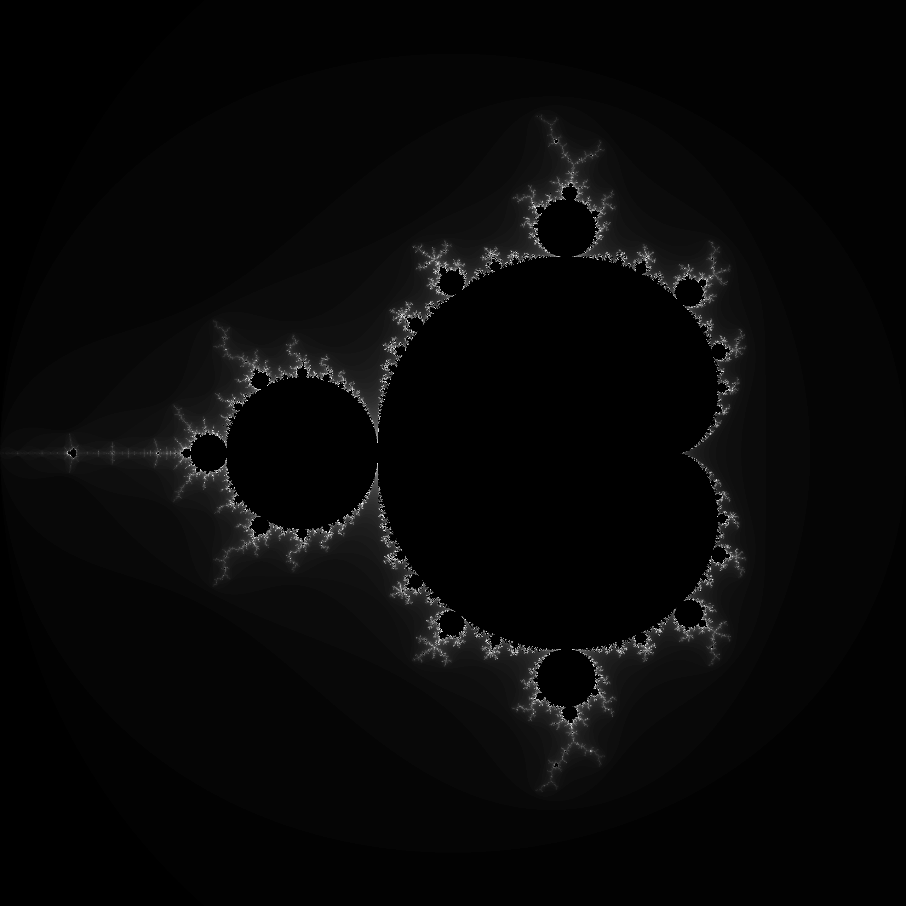

<div align="center">

  <h1><code>WASM Mandelbrot Example</code></h1>

  <strong>Sample Rust and WebAssembly project using <a href="https://github.com/rustwasm/wasm-pack">wasm-pack</a>.</strong>

  <sub>Built with 🦀🕸</sub>
</div>

## About

A simple WASM mandelbrot demo written in Rust.

## 🚴 Usage

### Setup toolchain

* Installing rust with [rustup](https://rustup.rs/)

  ```
  curl --proto '=https' --tlsv1.2 -sSf https://sh.rustup.rs | sh
  ```

* Add WASM target

  ```
  rustup target add wasm32-unknown-unknown
  ```

* Install `wasm-pack`

  ```
  curl https://rustwasm.github.io/wasm-pack/installer/init.sh -sSf | sh
  ```

### Build with `wasm-pack build`

```
wasm-pack build
```

### 🔬 Test in Headless Browsers with `wasm-pack test`

```
wasm-pack test --headless --chrome
```

### Run web server

```
cd www
npm install
npm start
```

Open http://localhost:8080

### Sample Image


